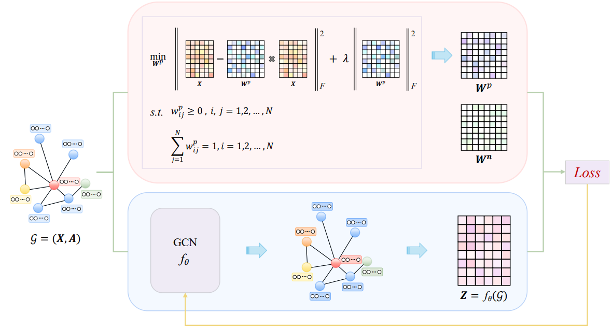

# ML²-GCL: Manifold Learning Inspired Lightweight Graph Contrastive Learning

## ML²-GCL architecture:


## 📂 Dataset Access

You can access and download the dataset from the following Google Drive link:

👉 [Click here to access the dataset](https://drive.google.com/drive/folders/1N6K4mLNX_5aK5G2vINRVTwCDrMq-mZII?usp=drive_link)

## 🚀 How to Run

Make sure you have the required Python environment and libraries installed. All required dependencies are listed in the `requirements.txt` file.

Then, run the main script using the following command:

```bash
python main.py
```

📚 Citation

If you find this work useful, please cite our ICML 2025 paper:
```bibtex
@inproceedings{liangml,
  title={ML$^2$-GCL: Manifold Learning Inspired Lightweight Graph Contrastive Learning},
  author={Liang, Jianqing and Li, Zhiqiang and Wei, Xinkai and Liu, Yuan and Wang, Zhiqiang},
  booktitle={Forty-second International Conference on Machine Learning},
  year={2025}
}
```


